<div align="center">

<!-- 3D Cyberpunk Particle Header with Advanced Shader Effects -->


</div>



<div align="center">

<!-- Contact Badges with Neon Styling -->
<a href="mailto:matrixdom@126.com">
  
</a>
<a href="https://linkedin.com/in/matriqi">
  
</a>
<a href="https://github.com/MatriQ">
  
</a>

<br/><br/>


</div>


<div align="center">

##  SYSTEM PROFILE

</div>

<table align="center" width="90%">
<tr>
<td width="50%" valign="top">

```yaml
ROLE: Senior Full-Stack Engineer
STATUS: Active & Available
EXPERIENCE: 16+ years
DOMAIN: Full-Stack | AI | Cloud
CLEARANCE: Senior Level
LOCATION: Remote | Global
```

</td>
<td width="50%" valign="top">

**🔷 SPECIALIZATIONS**

- Full-Stack Development & Architecture
- AI/ML Integration & Digital Humans
- Cloud Native & K8s Orchestration
- Real-time Systems & WebRTC
- Microservices & Distributed Systems

</td>
</tr>
</table>


<div align="center">

##  TECH ARSENAL

</div>

<div align="center">

### Languages


</div>

<br/>

<details open>
<summary><h3>🚀 Frontend Technologies</h3></summary>

<p align="center">
  
</p>

</details>

<details open>
<summary><h3>⚙️ Backend Technologies</h3></summary>

<p align="center">
  
</p>

</details>

<details open>
<summary><h3>☁️ DevOps & Cloud</h3></summary>

<p align="center">
  
</p>

</details>

<details>
<summary><h3>💾 Databases & Caching</h3></summary>

<p align="center">
  
</p>

</details>

<details>
<summary><h3>🎮 Game & 3D Development</h3></summary>

<p align="center">
  
</p>

</details>


<div align="center">

##  CONTRIBUTION ACTIVITY


</div>


<div align="center">

##  PROFESSIONAL JOURNEY

</div>

<details open>
<summary>
  <h3>
    
    bitHuman Inc - Senior Full-Stack Engineer
  </h3>
  <p>🗓️ Dec 2023 - Feb 2025</p>
</summary>

<br/>

**Key Achievements:**
- 🏗️ Architected digital human system with communication & billing modules
- 🤖 Developed Agent generation module and LLM-powered conversation system
- 👨‍💻 Established frontend code review best practices
- 🚀 Deployed scalable K8s infrastructure with Helm

**Tech Stack:**
<br/>


</details>

<details>
<summary>
  <h3>
    
    AiFi Inc - Senior Full-Stack Engineer
  </h3>
  <p>🗓️ Sep 2019 - Dec 2023</p>
</summary>

<br/>

**Key Achievements:**
- 🏪 Built Store Console for unmanned store calibration & data management
- 🔌 Implemented Store API & CoreAPI for core business services
- 🛠️ Created Human Assistance Tool for order verification
- 🎯 Delivered end-to-end solutions from backend to frontend

**Tech Stack:**
<br/>


</details>

<details>
<summary>
  <h3>
    
    Chengdu Panda Network Tech - Co-Founder
  </h3>
  <p>🗓️ Mar 2018 - Sep 2019</p>
</summary>

<br/>

**Key Achievements:**
- 📱 Built Baibu WeChat Mini Program from ground up
- ☁️ Developed Cloud Disk Client using Windows shell and C++
- 🎥 Implemented 8-channel 4K video capture system
- 🚀 Led technical direction and product development

**Tech Stack:**
<br/>


</details>


<div align="center">

##  EDUCATION

</div>

<table align="center" width="80%">
<tr>
<td width="50%" align="center">

### 🎓 Southwest University
**MBA - Business Administration**
<br/>
📅 2022 - 2025


</td>
<td width="50%" align="center">

### 🎓 Sichuan Top IT Vocational College
**Network Engineering**
<br/>
📅 2006 - 2009


</td>
</tr>
</table>


<div align="center">

##  HONORS & AWARDS

</div>

<table align="center" width="85%">

<tr><td colspan="2"><h3>🏆 2024 - Dify Key Contributor</h3></td></tr>
<tr>
<td width="100%" colspan="2">

<br/>
Recognition for significant contributions to the Dify open-source project
</td>
</tr>

<tr><td colspan="2"><h3>🏆 2012 - Windows 8 Development Marathon Champion</h3></td></tr>
<tr>
<td width="100%" colspan="2">

<br/>
1st Place - Southwest Region Champion
</td>
</tr>

<tr><td colspan="2"><h3>🏆 2008 - Competition Excellence</h3></td></tr>
<tr>
<td width="100%" colspan="2">


<br/>
Outstanding Contestant - Chengdu International Software Competition (Nov 2008)
<br/>
2nd Prize - Sichuan Provincial Computer Competition (Jul 2008)
</td>
</tr>

<tr><td colspan="2"><h3>🏆 2007 - Outstanding Contestant</h3></td></tr>
<tr>
<td width="100%" colspan="2">

<br/>
Chengdu International Software Development Competition
</td>
</tr>

</table>


<div align="center">

##  CONTRIBUTION GRAPH

<picture>
  <source media="(prefers-color-scheme: dark)" srcset="https://raw.githubusercontent.com/MatriQ/MatriQ/output/github-snake-dark.svg" />
  <source media="(prefers-color-scheme: light)" srcset="https://raw.githubusercontent.com/MatriQ/MatriQ/output/github-snake.svg" />
  
</picture>

</div>


<div align="center">


<br/><br/>


</div>
