<div align="center">

<!-- 3D Cyberpunk Particle Header with Shader Effects -->


<!-- Alternative: Dynamic Typing Animation Header -->
<!--  -->

<!-- Glitch Effect Divider -->


</div>

<div align="center">

<!-- Contact Badges with Neon Styling -->
<a href="mailto:matrixdom@126.com">
  
</a>
<a href="https://linkedin.com/in/matriqi">
  
</a>
<a href="https://github.com/MatriQ">
  
</a>

<br/><br/>

<!-- Profile Views Counter with Cyberpunk Style -->


</div>

<br/>

<!-- Animated Separator -->


<div align="center">

##  SYSTEM INFORMATION

</div>

<table align="center">
<tr>
<td width="50%" valign="top">

###  PROFILE.SYS

```yaml
ROLE: Senior Full-Stack Engineer
STATUS: Active & Available
EXPERIENCE: 16+ years
DOMAIN: Full-Stack | System Architecture | AI
CLEARANCE: Senior Level
TEAMS: Multinational (EU/US) - 5+ years
LOCATION: Remote | Global
```

**SPECIALIZATIONS:**
- 🔷 Full-Stack Development & Architecture
- 🔷 AI/ML Integration & Digital Humans
- 🔷 Cloud Native & K8s Orchestration
- 🔷 Real-time Systems & WebRTC
- 🔷 Microservices & Distributed Systems

</td>
<td width="50%" valign="top">

###  PERFORMANCE METRICS

<p align="center">
  
</p>

<p align="center">
  
</p>

</td>
</tr>
</table>


<div align="center">

##  ACHIEVEMENTS

</div>

<p align="center">
  
</p>


<div align="center">

##  ACTIVITY GRAPH

</div>

<p align="center">
  
</p>


<div align="center">

##  PROGRAMMING LANGUAGES

</div>

<div align="center">

<!-- Primary Languages -->


<br/>

<!-- Secondary Languages -->


</div>

<br/>

<!-- Language Stats -->
<p align="center">
  
</p>


<div align="center">

##  TECHNOLOGY STACK

</div>

###  Frontend

<p align="center">
  
</p>

###  Backend

<p align="center">
  
</p>

###  DevOps & Cloud

<p align="center">
  
</p>

###  Databases & Caching

<p align="center">
  
</p>

###  Game & 3D Development

<p align="center">
  
</p>


<div align="center">

##  CURRENT FOCUS

</div>

<table align="center">
<tr>
<td width="50%" align="center">

### 🔭 Currently Working On

- **AI Digital Human Systems**
  
  

- **LLM Integration & Agent Systems**
  
  

- **Cloud Native Architecture**
  
  

</td>
<td width="50%" align="center">

### 🌱 Currently Learning

- **Advanced AI/ML Ops**
  
  

- **Blockchain & Web3**
  
  

- **Advanced System Design**
  
  

</td>
</tr>
</table>


<div align="center">

##  PROFESSIONAL EXPERIENCE

</div>

###  bitHuman Inc
**Senior Full-Stack Engineer** | 🗓️ Dec 2023 - Feb 2025

<details open>
<summary><b>Key Responsibilities & Achievements</b></summary>

- 🏗️ Architected digital human system including communication & billing modules
- 🤖 Developed Agent generation module and LLM-powered Conversation system
- 👨‍💻 Conducted frontend code reviews and established best practices
- 🚀 Deployed scalable infrastructure using K8s with Helm charts

**Tech Stack:**


</details>

---

###  AiFi Inc
**Senior Full-Stack Engineer** | 🗓️ Sep 2019 - Dec 2023

<details>
<summary><b>Key Responsibilities & Achievements</b></summary>

- 🏪 Developed Store Console for unmanned stores calibration & data management
- 🔌 Implemented Store API & CoreAPI for core business services
- 🛠️ Created Human Assistance Tool for order verification in unmanned stores
- 🎯 Delivered end-to-end solutions from backend to frontend

**Tech Stack:**


</details>

---

###  Chengdu Panda Network Tech Ltd.
**Co-Founder** | 🗓️ Mar 2018 - Sep 2019

<details>
<summary><b>Key Responsibilities & Achievements</b></summary>

- 📱 Developed Baibu WeChat Mini Program from ground up
- ☁️ Created Cloud Disk Client using Windows shell and C++
- 🎥 Implemented Video Capture System handling 8 channels of 4K video data
- 🚀 Led technical direction and product development as co-founder

**Tech Stack:**


</details>


<div align="center">

##  EDUCATION

</div>

<table align="center">
<tr>
<td width="50%" valign="top">

### 🎓 Southwest University
**Master of Business Administration (MBA)**
📅 2022 - 2025


</td>
<td width="50%" valign="top">

### 🎓 Sichuan Top IT Vocational College
**Network Engineering**
📅 2006 - 2009


</td>
</tr>
</table>


<div align="center">

##  HONORS & AWARDS

</div>

<table align="center">
<tr>
<td width="20%">

**🏆 May 2024**

</td>
<td width="80%">

### Dify Key Contributor


**Recognition for significant contributions to the Dify open-source project**

</td>
</tr>
<tr>
<td width="20%">

**🏆 Nov 2012**

</td>
<td width="80%">

### 1st Place - Windows 8 Development Marathon


**Southwest Region Champion** - Windows 8 App Development Competition

</td>
</tr>
<tr>
<td width="20%">

**🏆 Nov 2008**

</td>
<td width="80%">

### Outstanding Contestant - Chengdu International Software Competition


**2008 Chengdu International Software Development Competition**

</td>
</tr>
<tr>
<td width="20%">

**🏆 Jul 2008**

</td>
<td width="80%">

### 2nd Prize - Sichuan Provincial Computer Competition


**Sichuan Provincial University Student Computer Competition**

</td>
</tr>
<tr>
<td width="20%">

**🏆 Oct 2007**

</td>
<td width="80%">

### Outstanding Contestant - Chengdu International Software Competition


**2007 Chengdu International Software Development Competition**

</td>
</tr>
</table>


<div align="center">

##  CONTRIBUTION SNAKE

</div>

<p align="center">
  <picture>
    <source media="(prefers-color-scheme: dark)" srcset="https://raw.githubusercontent.com/MatriQ/MatriQ/output/github-snake-dark.svg" />
    <source media="(prefers-color-scheme: light)" srcset="https://raw.githubusercontent.com/MatriQ/MatriQ/output/github-snake.svg" />
    
  </picture>
</p>

<br/>

<!-- Alternative: Ocean GIF with custom cyberpunk colors -->
<p align="center">
  
</p>


<div align="center">

<!-- Dynamic Quote -->


<br/><br/>

<!-- Footer Banner -->


</div>
